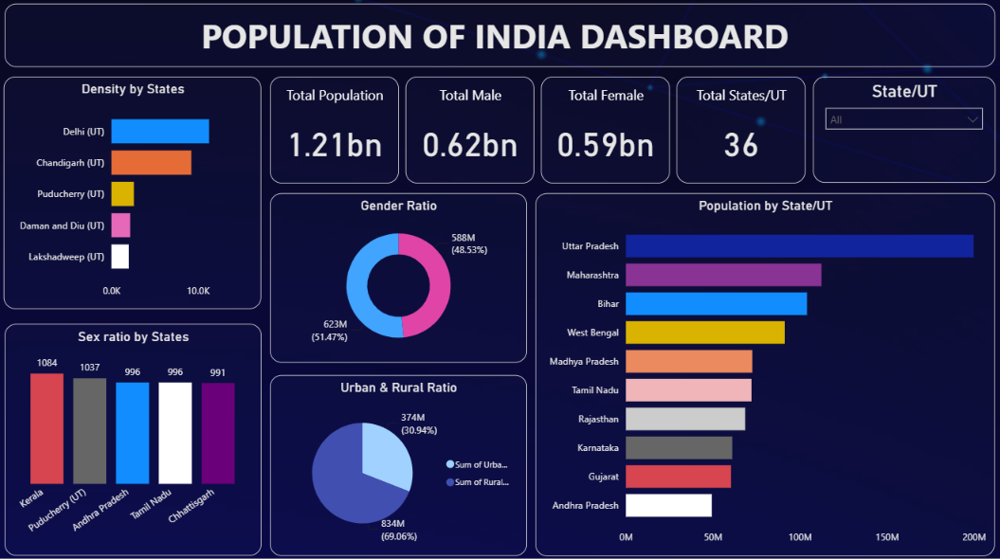

# Indian Population Analysis Dashboard | Power BI

An interactive Power BI dashboard for exploring India's population, gender distribution, state-wise population, population density, and urban-rural distribution.

## 📊 Project Overview

This dashboard provides a visual analysis of India's population across States and Union Territories, with interactive filtering by State/UT.

## 🛠️ Tools & Technologies

- Power BI
- DAX
- Power Query
- Data Modeling
- Data Visualization

## 📌 Dashboard Features

- Total population, male and female population KPIs
- Population by State/UT
- Population density by State/UT
- Gender ratio analysis
- Sex ratio comparison across states
- Urban vs. rural population distribution
- Interactive State/UT filter

## 📈 Dashboard Preview

## 🔍 Key Insights

- India’s total population in the dataset is approximately **1.21 billion**.
- The dataset contains **36 States/Union Territories**.
- Uttar Pradesh has the highest population among the displayed States/UTs.
- The dashboard provides a comparison of urban and rural population distribution.
- Sex ratio and gender distribution can be analyzed across individual States/UTs.

## 🎯 Project Objective

To transform population data into an interactive dashboard that makes demographic patterns and state-level population differences easier to understand.
